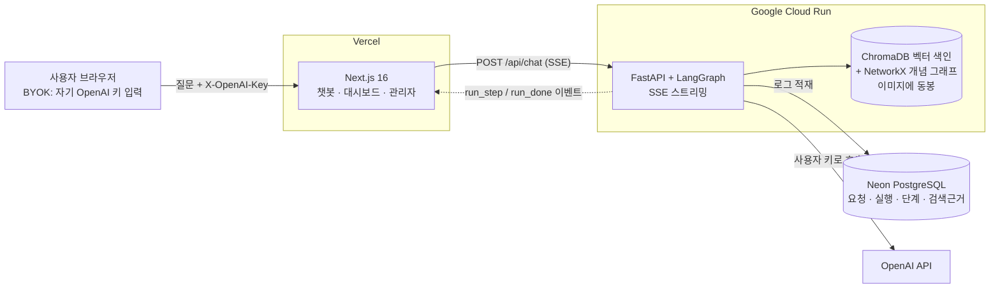
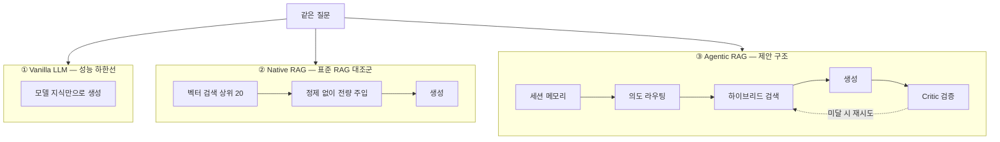
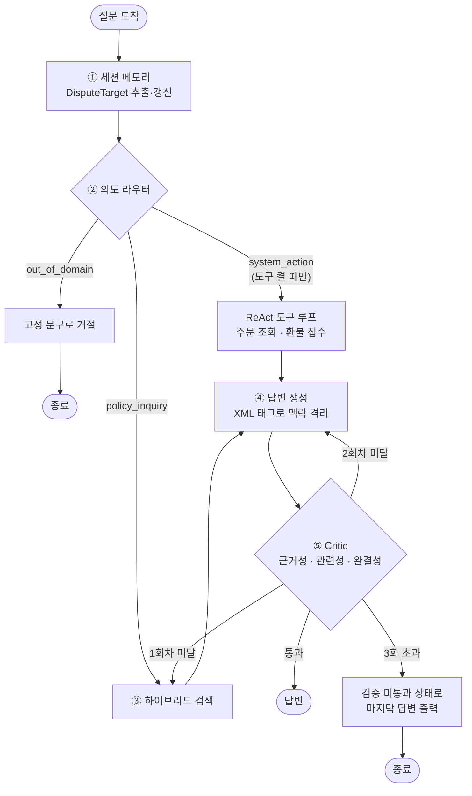
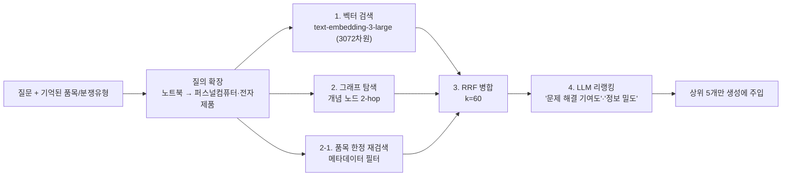
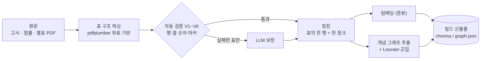
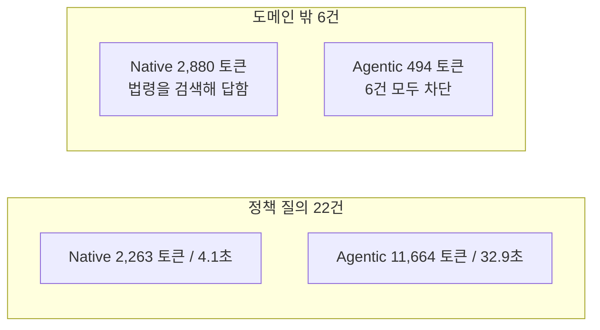

# 소비자 분쟁 Q&A 챗봇

한국소비자원 상담 상황을 대상으로 **Vanilla LLM · Native RAG · Agentic RAG 세 가지 파이프라인을 같은 질문에 동시에 돌려 비교**하는 서비스입니다.
논문 「Agentic AI의 실효성 검증: 소비자 분쟁 Q&A 챗봇 파이프라인 설계 및 평가」의 구조를 재현하고, 그것을 실제로 쓸 수 있는 웹 제품으로 만들었습니다.

**왜 세 개를 동시에 돌리나요?** "에이전트 구조가 정말 더 나은가"는 말로 설명하기 어렵습니다.
같은 질문에 대해 세 답변과 **토큰·지연·비용·검색 근거·검증 판정을 나란히** 보여 주면, 차이가 눈에 보입니다.

- 지식베이스: 소비자분쟁해결기준(공정위 고시) + 전자상거래법 → 청크 1,654개, 개념 그래프 노드 2,663개
- 모델: GPT-5.6 Luna(기본) · GPT-5.6 Terra · GPT-4o 중 선택
- API 키: 사용자가 자기 키를 넣습니다(BYOK). 서버는 키를 저장하지 않습니다

---

## 1. 전체 구성



**설계 의도**

| 선택 | 이유 |
|---|---|
| 벡터 색인을 **컨테이너 이미지에 동봉** | 재검색이 잦은 순환 구조라 네트워크 지연이 누적되면 안 됩니다. 로컬 파일 읽기가 가장 빠릅니다 |
| **SSE**(EventSource 아님) | 파이프라인이 끝나는 순서대로 화면에 꽂아 주려면 스트리밍이 필요한데, API 키를 헤더로 보내야 해서 `fetch` 스트림을 씁니다 |
| **BYOK** | 공개 서비스에서 운영자가 토큰 비용을 전부 떠안지 않기 위해서입니다. 키는 브라우저에만 남습니다 |
| 로그에 **검색 근거 원문 스냅샷** 저장 | 지식베이스를 다시 만들어도 "그때 무엇을 보고 답했는지"가 남아야 합니다 |

---

## 2. 세 파이프라인



| | Vanilla | Native RAG | Agentic RAG |
|---|---|---|---|
| 역할 | 검색이 없을 때의 하한선 | 검색만 붙였을 때의 기준 | 검증·라우팅까지 붙인 제안 구조 |
| 검색 | 없음 | 벡터 단독, 정제 없음 | 벡터 + 그래프 + RRF + 리랭킹 |
| 자기 검증 | 없음 | 없음 | Critic 3기준 · 최대 3회 |
| 도메인 밖 질문 | 그냥 답해 버림 | 엉뚱한 법령을 검색 | 라우터가 즉시 거절 |
| 실측 평균 토큰 | 1,107 | 2,395 | 9,270 |

> 실측은 28문항(정책 22 + 도메인 밖 6), GPT-5.6 Luna 기준입니다.
> Native RAG를 **일부러 정제 없이** 두는 이유는 대조군이기 때문입니다. 검색만 붙이면 오히려 나빠지는 현상("맥락 혼동")을 드러내려는 구성입니다.

---

## 3. Agentic RAG 내부 (LangGraph 상태 그래프)



### 각 노드를 왜 두었나

| 노드 | 기술 | 왜 이 기술인가 |
|---|---|---|
| ① 세션 메모리 | LangGraph `MemorySaver` + Pydantic `DisputeTarget` | 대화 전문을 쌓으면 컨텍스트가 부풀고 환각이 늘어납니다. **품목·분쟁유형·주문번호만** 남겨 다음 턴으로 넘깁니다. `"그럼 환불은요?"`처럼 품목이 빠진 후속 질문이 엉뚱한 표를 찾는 것을 막습니다 |
| ② 의도 라우터 | Structured Output + 퓨샷 | 모든 질문을 무거운 추론 루프에 태우면 지연과 도구 오남용이 생깁니다. 진입점에서 분기시켜 **무관한 질의는 검색 전에 차단**합니다 |
| ③ 하이브리드 검색 | ChromaDB + NetworkX + RRF + LLM 리랭커 | 아래 §4 |
| ④ 생성 | XML 태그 맥락 격리 | `<retrieved_documents>`로 감싸 모델 내부 지식과 검색 문서가 섞이는 것을 막습니다 |
| ⑤ Critic | Self-RAG를 Structured Output으로 | 법률 도메인에서 가장 치명적인 오류는 **근거 없는 답변**입니다. 판정 전에 `feedback`을 먼저 쓰게 해(CoT) 다음 회차에 교정 방향을 남깁니다 |

**Critic이 3회를 넘기면 복구 장치 없이 마지막 답변을 그대로 내보냅니다.** 검증 미통과 표시가 붙습니다.
안전성과 답변 성공률 사이의 트레이드오프를 감추지 않고 그대로 보여 주기 위한 선택입니다.

---

## 4. 하이브리드 검색



| 단계 | 왜 |
|---|---|
| 3072차원 임베딩 | '청약철회 / 계약해제 / 취소'는 표면은 비슷하고 법적 효력은 전혀 다릅니다. 저차원 모델은 이 차이를 뭉갭니다 |
| 그래프 탐색 | 벡터만으로는 `청약철회 → 전자상거래법 제17조 → 7일 이내` 같은 **간접 참조 관계**가 잡히지 않습니다 |
| RRF 병합 | 점수 체계가 다른 두 검색 결과를 순위만으로 합칩니다. 정규화가 필요 없습니다 |
| LLM 리랭킹 | 단어가 겹친다고 유용한 문서는 아닙니다. 기준을 '문제 해결 기여도'로 바꿉니다 |
| 질의 확장 · 품목 한정 재검색 | 고시는 '퍼스널컴퓨터'라 적고 사용자는 '노트북'이라 씁니다. 또 별표Ⅱ는 품목이 달라도 문구가 거의 같아(해결기준 중앙값 17자) 품목 구분이 묻힙니다 |

---

## 5. 지식베이스 구축

원문이 **표로 된 고시**라 일반적인 청킹으로는 의미가 무너집니다.



- **행 단위 청킹**: `별표Ⅱ > 전자제품·사무용기기 > 품질보증기간 이내 하자 > 무상수리`처럼 **경로**를 만들어 붙입니다. 500자 단위로 자르면 이 경로가 사라져 검색 결과가 개정 이력 덩어리가 됩니다
- **자동 검증이 실제로 데이터 손실을 잡았습니다**: 한 쪽에 표가 여럿일 때 제목이 섞이던 문제, 분쟁유형 둘째 줄이 버려지던 문제, 표가 쪽 경계에서 쪼개지던 문제
- 결과: 표 157개 중 156개 규칙 파싱 통과, 청크 1,654개, 그래프 노드 2,663 · 군집 601개

---

## 6. 무엇이 실제로 관찰되었나



- **라우터 효과는 뚜렷합니다.** 무관한 질문에서 Agentic은 Native의 17%만 씁니다
- **재시도 비용도 뚜렷합니다.** 정책 질의에서 Critic 1회 통과는 22건 중 9건이고, 3회를 모두 쓴 경우가 7건입니다
- 즉 이 구조의 이득은 *검색을 잘해서*가 아니라 **쓸데없는 검색을 막고, 나온 답을 스스로 검열해서** 나옵니다. 그 대가가 지연과 토큰입니다

---

## 7. 기술 스택

| 영역 | 선택 | 이유 |
|---|---|---|
| 그래프 오케스트레이션 | **LangGraph** | 검색→생성→비평→재검색의 **순환**이 필요합니다. 체인으로는 되돌아갈 수 없습니다 |
| 구조화 출력 | **Pydantic + json_schema strict** | 라우팅 결과가 문자열이면 분기가 흔들립니다. 스키마로 강제해 **확률적 생성을 분기 스위치로** 바꿉니다 |
| 벡터 DB | **ChromaDB (로컬 영속)** | 한 요청에서 재검색이 최대 3회 일어납니다. 클라우드 DB의 왕복 지연이 누적되면 응답 예산을 넘깁니다 |
| 그래프 | **NetworkX + Louvain** | 조항 간 참조 관계를 담고, 군집으로 관련 조항을 묶습니다 |
| 백엔드 | **FastAPI + SSE** | 세 파이프라인을 동시에 돌리고 끝나는 대로 흘려보냅니다 |
| 프런트 | **Next.js 16 + Tailwind 4 + shadcn/ui** | |
| DB | **PostgreSQL (Neon)** | 로그를 무기한 보관하고 대시보드 집계에 씁니다 |
| 배포 | **Vercel + Cloud Run + Neon** | 무료 한도 안에서 상시 운영 가능한 조합입니다. Cloud Run은 쉬면 0으로 줄어듭니다 |

---

## 8. 실행

```bash
# 백엔드
cd apps/api
uv sync
uv run uvicorn app.main:app --port 8100

# 프런트
pnpm --dir apps/web install
pnpm --dir apps/web dev --port 3100
```

지식베이스를 새로 만들려면 (운영자 키 `OPENAI_API_KEY` 필요):

```bash
cd apps/api && uv run kb build
```

주요 환경변수

| 이름 | 기본값 | 설명 |
|---|---|---|
| `DATABASE_URL` | 로컬 Postgres | Neon은 `postgresql+asyncpg://...?ssl=require` 형태로 |
| `ALLOWED_ORIGINS` | `http://localhost:3100` | 프런트 도메인 |
| `NATIVE_MODE` | `paper` | Native RAG 주입 방식 (`paper` 전량 / `compressed` 리랭킹 5개) |
| `CRITIC_EXHAUSTED` | `paper` | Critic 소진 시 처리 (`paper` 그대로 출력 / `native_fallback` 대체) |
| `TOOLS_ENABLED` | `false` | 도구 호출·가상 주문 DB |
| `SESSION_MAX` / `SESSION_TTL_MIN` | 500 / 120 | 세션 메모리 상한 |

---

## 9. 구조 요약

```
apps/api/
  app/pipelines/    vanilla · native · agentic 그래프, 세션 메모리
  app/kb/           하이브리드 검색기, 지식베이스 적재
  app/tools/        Lightweight ReAct 도구 + 가상 주문 DB (기본 꺼짐)
  app/api/          /api/chat(SSE) · 대시보드 · 관리자 로그
  kb_build/         표 파싱 → 검증 → 청킹 → 임베딩 → 그래프
  cli/              kb 빌드, 표준답변 대조표, 도구 편향 실험
apps/web/src/       챗봇 · 대시보드 · 관리자 화면
```

기획·설계 문서(문제 정의, 데이터 분석, UX/IA, 시스템 설계, 배포 런북, 논문 대조)는
상담 데이터와 논문 원문을 포함하고 있어 저장소에 넣지 않았습니다.
